# Documentation Data Mining

by:

- عبدالرحمن رعدان
- مصعب الحبيشي
- هادي الجمعي
- مالك المصبحي
- عبدالعزيز عبدالغني
- ماجد النائب

---

## Data Preprocessing Steps

### Handling Delimiters

- **Step 1:** Converting Commas to Semicolons in the Dataset  
 **Objective:** Ensure the dataset is properly formatted by replacing all semicolons (;) with commas (,).

  <div style="display: flex; justify-content: space-between;">
  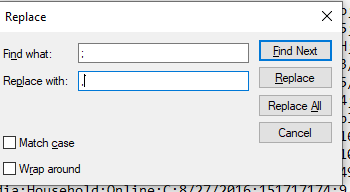
</div>

- **Step 2:** Clean the "Country" Column Data
  **Objective**: Ensure data quality by addressing issues with special characters. In our database, we found that the value "Cote d'Ivoire" in the "Country" column contains an apostrophe, which is causing an error in the Wiki.

  **Problem**: The value "Cote d'Ivoire" includes an apostrophe that leads to errors during data analysis or query execution.

- **Step** 3: Re-encoding the "Order Priority" Column
  We performed re-encoding of the textual values in the "Order Priority" column into numerical values to facilitate processing by machine learning algorithms.

  The values were transformed as follows:

  ```
  Critical → 3
  High → 2
  Medium → 1
  Low → 0
  ```

  This step was necessary because some algorithms, such as Naïve Bayes and K-Means, require numerical data for analysis and processing.

    <div style="display: flex; justify-content: space-between; padding:15px;">
    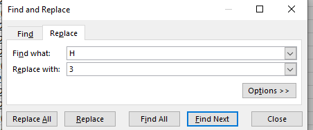
    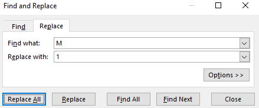
  </div>

## Algorithm Implementation

### Apriori Algorithm (Association Rule Mining)

- **Objective:** Discover frequent itemsets and generate association rules.
- **Selected Columns:** Item Type, Sales Channel.
- **Parameters:**
  - Support Threshold: A reasonable value based on dataset characteristics.
  - Confidence Threshold: Set a meaningful value to filter rules.
  - Lift: Evaluated to assess rule significance.
- **Steps:**
  - Preprocessed data by removing duplicates and inconsistencies.
  - Implemented Apriori using association rule mining tools in Weka.

<div style="display: flex; justify-content: space-between;">
  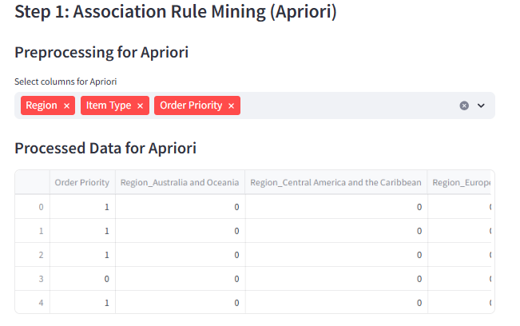
</div>

---

### Naïve Bayes (Classification)

- **Objective:** Build a probabilistic model to classify data into predefined classes.
- **Selected Columns:** Region, Country, Item Type, Sales Channel, Order Priority.
- **Steps:**
  - Split dataset into training (70%) and testing (30%) sets.
  - Assumed feature independence.
  - Evaluated model using accuracy, precision, recall, and F1-score.

<div style="display: flex; justify-content: space-between; padding:15px;">
  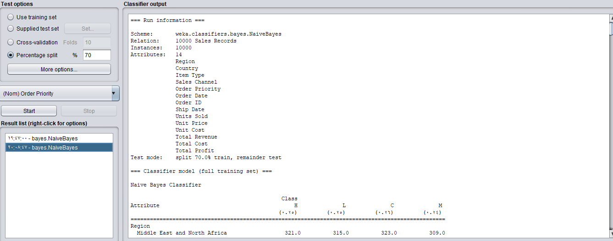
  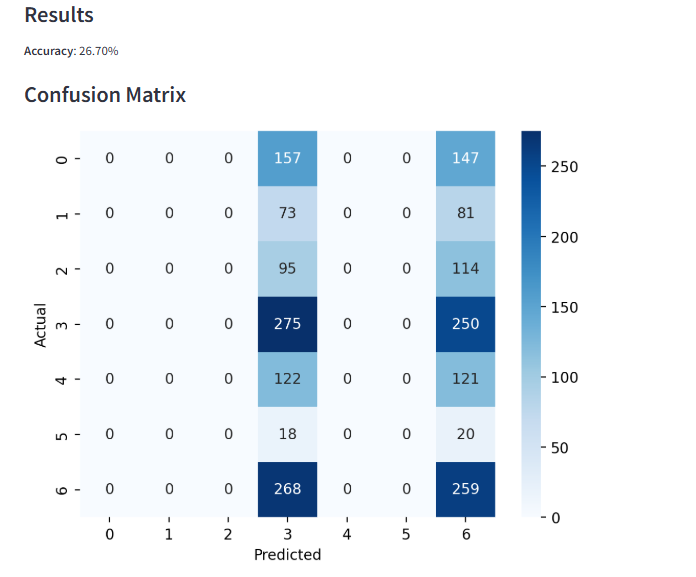
</div>

<div style="display: flex; justify-content: space-between; padding:15px;">
  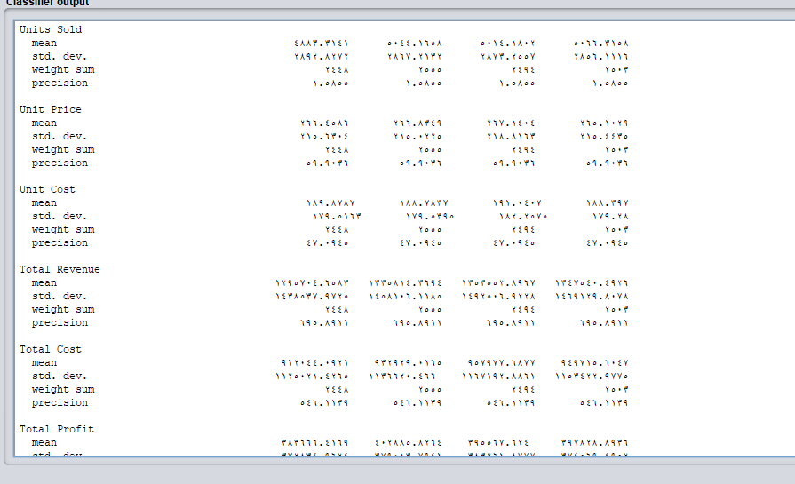
  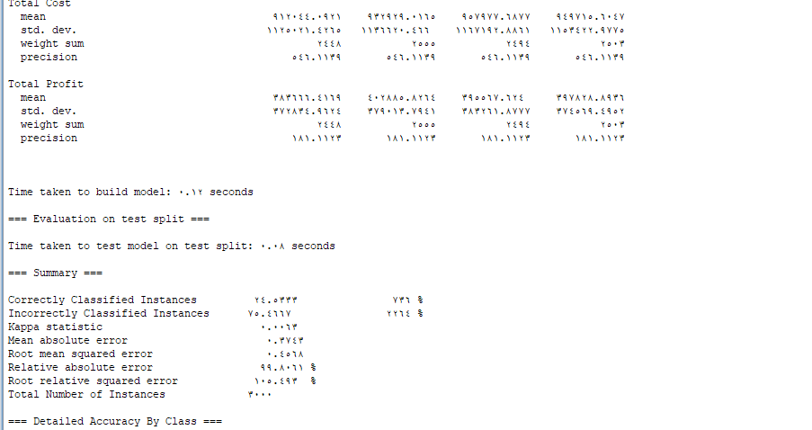
</div>

<div style="display: flex; justify-content: space-between; padding:15px;">
  
  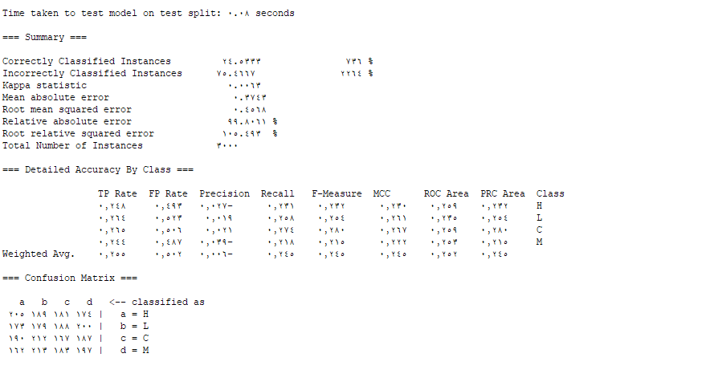
</div>

### **Algorithm and Reasoning:**

Based on the code and applying the Naïve Bayes algorithm to identify relationships between products, we transformed the data into binary format (0 and 1) to simplify the analysis.

**Relevant Columns:**

- **Region:** Useful for understanding geographic influence on purchasing behavior.
- **Country:** To identify differences between countries.
- **Item Type:** To know the types of products that are bought together.
- **Sales Channel:** To understand the differences between various sales channels (online and offline).
- **Order Priority:** To understand how order priority affects product relationships.

### **Why did we choose min_support = 0.05?**

- **Large dataset:** The data contains 10,000 records, and the minimum support value means that any product combination must appear in 0.05 × 10000 = 500 transactions to be considered significant.
- **Avoiding noise:** Using a very low value might lead to identifying insignificant patterns. By increasing min_support, we ensure that we focus on strong and important relationships.

### **Why did we set min_confidence = 0.5?**

- **Confidence in detected patterns:** This means that we are interested in relationships that have a high probability of occurring. If the confidence value is lower than 0.5, the patterns might be unreliable.
- **Identifying significant patterns:** We want to ensure that the extracted rules have high confidence to be useful in recommendations and marketing.

### **Final Notes:**

Converting data to binary format and choosing appropriate values for minimum support and confidence helps improve the accuracy and efficiency of the model. If you need further clarification or have any other questions, feel free to ask!

---

### ID3 Algorithm (Decision Trees)

- **Objective:** Create decision trees based on information gain.
- **Selected Columns:** Region, Item Type, Sales Channel, Order Priority, Order Date.
- **Steps:**
  - Used entropy and information gain to construct the tree.
  - Visualized decision tree structure.
  - Evaluated accuracy using cross-validation.

### K-Means Algorithm (Clustering)

- **Objective:** Partition the data into clusters based on similarity.
- **Selected Columns:** Units Sold, Unit Price, Total Revenue, Total Profit.
- **Parameters:**
  - Number of Clusters (K): Determined using the elbow method.
  - Initialization: Used k-means++ to enhance convergence.
- **Steps:**
  - Standardized the data.
  - Applied K-Means clustering algorithm.
  - Visualized clusters and centroids.

<div style="display: flex; justify-content: space-between; padding:15px;">
  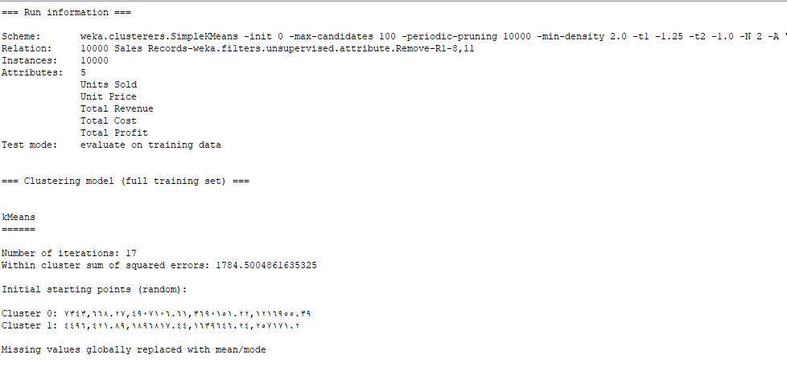
  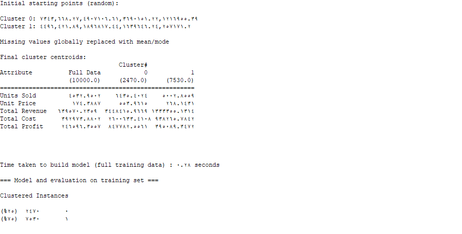
</div>

## Evaluation Metrics

- Used metrics such as accuracy, precision, recall, F1-score, Silhouette Score, and Inertia.

## Results and Insights

- Visualizations provided insights into sales trends, classification outcomes, and cluster formations.
- Performance scores highlighted the effectiveness of different algorithms for the dataset.
