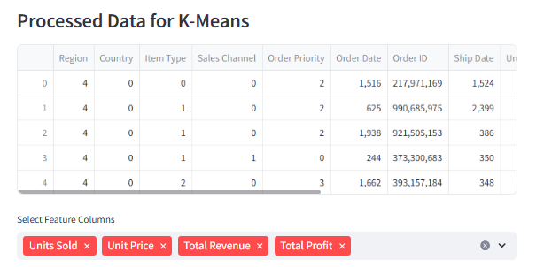

<br>
<br>
<br>
<br>
<br>
<br>

# Documentation Data Mining

<br>
<br>
<br>

by:

- عبدالرحمن رعدان
- مصعب الحبيشي
- هادي الجمعي
- مالك المصبحي
- عبدالعزيز عبدالغني
- ماجد النائب

<br>
<br>
<br>
<br>
<br>
<br>
<br>
<br>
<br>
<br>
<br>
<br>
<br>
<br>

<br>

#### اشراف :

أ. ابراهيم الذارحي
<br>
<br>
<br>
<br>
<br>
<br>
<br>
<br>
<br>

## Data Preprocessing Steps

### Handling Delimiters

- **Step 1:** Converting Commas to Semicolons in the Dataset  
 **Objective:** Ensure the dataset is properly formatted by replacing all semicolons ( ; ) with commas (,).

  <div style="display: flex; justify-content: space-between;">
  
</div>

- **Step 2:** Clean the "Country" Column Data
  **Objective**: Ensure data quality by addressing issues with special characters. In our database, we found that the value "Cote d'Ivoire" in the "Country" column contains an apostrophe, which is causing an error in the Wiki.

  **Problem**: The value "Cote d'Ivoire" includes an apostrophe that leads to errors during data analysis or query execution.

- **Step** 3: Re-encoding the "Order Priority" Column
  We performed re-encoding of the textual values in the "Order Priority" column into numerical values to facilitate processing by machine learning algorithms.

  The values were transformed as follows:

  ```
  Critical → 3
  High → 2
  Medium → 1
  Low → 0
  ```

  This step was necessary because some algorithms, such as Naïve Bayes and K-Means, require numerical data for analysis and processing.

    <div style="display: flex; justify-content: space-between; padding:15px;">
    
    
  </div>
  <br>
  <br>
  <br>
  <br>
  <br>
  <br>

## Algorithm Implementation

### Apriori Algorithm (Association Rule Mining)

- **Objective:** Discover frequent itemsets and generate association rules.
- **Selected Columns:** Item Type, Sales Channel.
- **Parameters:**
  - Support Threshold: A reasonable value based on dataset characteristics.
  - Confidence Threshold: Set a meaningful value to filter rules.
  - Lift: Evaluated to assess rule significance.
- **Steps:**
  - Preprocessed data by removing duplicates and inconsistencies.
  - Implemented Apriori using association rule mining tools in Weka.

<div style="display: flex; justify-content: space-between;">
  
</div>
<div style="display: flex; justify-content: space-between; padding:15px;">
  
  
</div>
<br>
<br>
<br>
<br>
<br>
<br>
<br>
<br>
<br>
<br>
<br>
<br>
<br>
<br>
<br>

### **Algorithm and Reasoning:**

The Apriori algorithm is used to identify frequent itemsets in a dataset and generate association rules. It helps in discovering interesting relationships between variables in large databases.

**Parameters:**

- **Support Threshold:** A minimum percentage of records in the dataset that contain the itemset. In our case, with 10,000 records, a support threshold of 0.05 means any itemset must appear in at least 500 transactions to be considered significant.
- **Confidence Threshold:** The likelihood that a rule is true for the dataset. A threshold of 0.5 means we are interested in rules where the likelihood is at least 50%.
- **Lift:** Measures the importance of a rule. Lift > 1 indicates a strong association.

<br>
<br>
<br>
<br>
<br>
<br>
<br>
<br>
<br>

### Naïve Bayes (Classification)

- **Objective:** Build a probabilistic model to classify data into predefined classes.
- **Selected Columns:** Region, Item Type, country.
- **Steps:**
  - Split dataset into training (80%) and testing (20%) sets.
  - Assumed feature independence.
  - Evaluated model using accuracy, precision, recall, and F1-score.

### **Algorithm and Reasoning:**

Naïve Bayes is a probabilistic classification algorithm based on Bayes' Theorem. It assumes that the presence of a particular feature in a class is unrelated to the presence of any other feature.

**Relevant Columns:**

- **Region:** Useful for understanding geographic influence on purchasing behavior.
- **Item Type:** To know the types of products that are bought together.

### **Results:**

- **Accuracy:** 36.25%.
- **Confusion Matrix:** Shows the number of correct and incorrect classifications.
<div style="display: flex; justify-content: space-between; padding:15px;">
  
  
</div>

<div style="display: flex; justify-content: space-between; padding:15px;">
  
  
</div>
<br>

- **Classification Report:** Includes Precision, Recall, F1-Score, and Support.

<div style="display: flex; justify-content: space-between; padding:15px;">
  
  
</div>

<br>

---

<br>
<br>
<br>
<br>

### ID3 Algorithm (Decision Trees)

- **Objective:** Create decision trees based on information gain.
- **Selected Columns:** Region, Item Type, Sales Channel, Order Priority, Order Date.
- **Steps:**
  - Used entropy and information gain to construct the tree.
  - Visualized decision tree structure.
  - Evaluated accuracy using cross-validation.

### K-Means Algorithm (Clustering)

- **Objective:** Partition the data into clusters based on similarity.
- **Selected Columns:** Units Sold, Unit Price, Total Revenue, Total Profit.
- **Parameters:**
  - Number of Clusters (K): Determined using the elbow method.
  - Initialization: Used k-means++ to enhance convergence.
- **Steps:**
  - Standardized the data.
  - Applied K-Means clustering algorithm.
  - Visualized clusters and centroids.

<div style="display: flex; justify-content: space-between; padding:15px;">
  
  
</div>
<h2>Silhouette Score: 0.60 </h2>
<br>
<br>
<br>
<br>
<br>
<br>
<br>
<br>
<br>
<br>
<br>
<br>
<br>
<br>
<br>

## Evaluation Metrics

<div style="display: flex; justify-content: space-between; padding:15px;">
  
  
</div>

## Results and Insights

<div style="display: flex; justify-content: space-between; padding:15px;">
  
  
</div>
