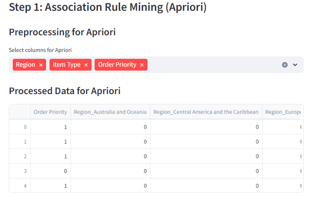

# Documentation

## Data Preprocessing Steps

### Handling Delimiters

- **Step 1:** Converting Commas to Semicolons in the Dataset  
  **Objective:** Ensure the dataset is properly formatted by replacing all semicolons (;) with commas (,).

- **Step 2:** Checking for Outliers, Missing Values, and Special Characters  
  **Objective:** Ensure the data quality by identifying and handling the following issues:

  - **Outliers:** Perform statistical analysis (such as interquartile range or z-score) to detect extreme data points that may affect model performance.
  - **Missing Values:** Identify missing entries and handle them through appropriate methods, such as imputation (mean, median, or mode) or row removal when necessary.
  - **Special Characters:** Detect and clean special characters such as the apostrophe in entries like "Cote d'Ivoire" to avoid parsing errors. These can be replaced by suitable alternatives (e.g., removing the apostrophe or using escape sequences).

  **Steps Taken:**

  - Applied functions to identify and visualize outliers.
  - Used conditional checks to replace or remove missing values.
  - Implemented a find-and-replace mechanism for problematic characters.

## Algorithm Implementation

### Apriori Algorithm (Association Rule Mining)

- **Objective:** Discover frequent itemsets and generate association rules.
- **Selected Columns:** Item Type, Sales Channel.
- **Parameters:**
  - Support Threshold: A reasonable value based on dataset characteristics.
  - Confidence Threshold: Set a meaningful value to filter rules.
  - Lift: Evaluated to assess rule significance.
- **Steps:**
  - Preprocessed data by removing duplicates and inconsistencies.
  - Implemented Apriori using association rule mining tools in Weka.

  

### Naïve Bayes (Classification)

- **Objective:** Build a probabilistic model to classify data into predefined classes.
- **Selected Columns:** Region, Country, Item Type, Sales Channel, Order Priority.
- **Steps:**
  - Split dataset into training (70%) and testing (30%) sets.
  - Assumed feature independence.
  - Evaluated model using accuracy, precision, recall, and F1-score.

  
  

  
  

  

### ID3 Algorithm (Decision Trees)

- **Objective:** Create decision trees based on information gain.
- **Selected Columns:** Region, Item Type, Sales Channel, Order Priority, Order Date.
- **Steps:**
  - Used entropy and information gain to construct the tree.
  - Visualized decision tree structure.
  - Evaluated accuracy using cross-validation.

### K-Means Algorithm (Clustering)

- **Objective:** Partition the data into clusters based on similarity.
- **Selected Columns:** Units Sold, Unit Price, Total Revenue, Total Profit.
- **Parameters:**
  - Number of Clusters (K): Determined using the elbow method.
  - Initialization: Used k-means++ to enhance convergence.
- **Steps:**
  - Standardized the data.
  - Applied K-Means clustering algorithm.
  - Visualized clusters and centroids.

  
  

## Evaluation Metrics

- Used metrics such as accuracy, precision, recall, F1-score, Silhouette Score, and Inertia.

## Results and Insights

- Visualizations provided insights into sales trends, classification outcomes, and cluster formations.
- Performance scores highlighted the effectiveness of different algorithms for the dataset.
